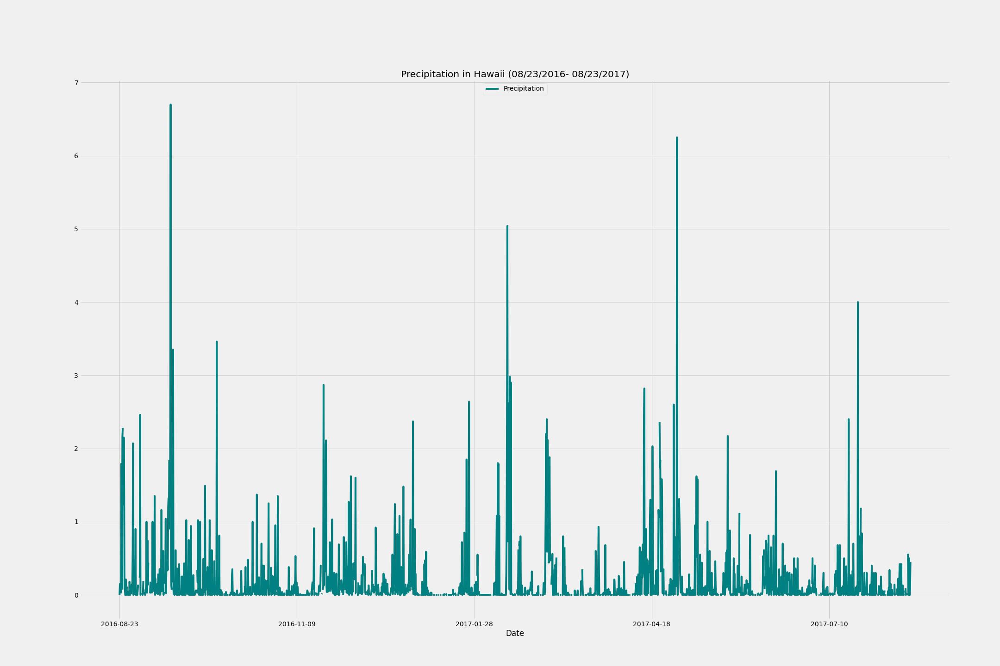

# SQL-Alchemy-Challenge

I use the provided starter notebook and hawaii.sqlite files to do Hawaii climate analysis and data exploration. I use use Python and SQLAlchemy for the analysis and data exploration purpose. 

## Precipitation Analysis
- I retrieve the data from the last 12 months using Pandas and plot the date and precipitation on a graph. From this data I was able to produce the graph below that shows Precipitation in Hawaii from 08/23/2016- 08/23/2017.

## Station Analysis
-I design a query to calculate the total number of stations, the most active stations, and the last 12 months of temperature observation data (TOBS) from the most active station.

